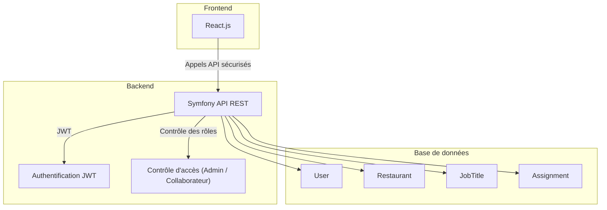
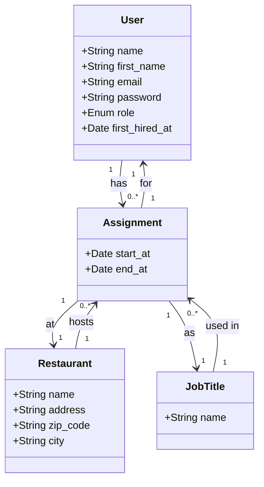
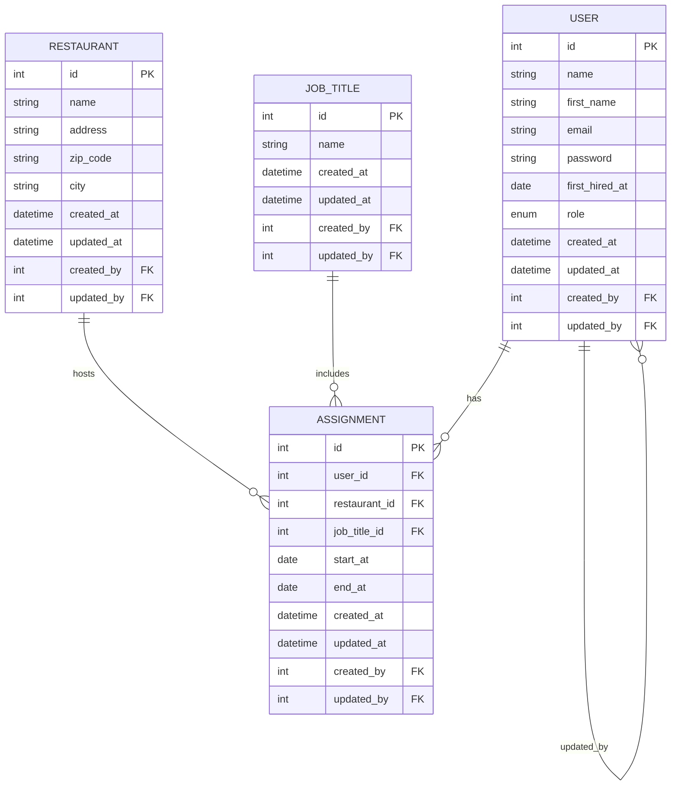

---
cssclasses:
---
Wacdo : Spécifications fonctionnelles et techniques
=======================================================

## Besoins du client

Permettre de gérer les affectations collaborateur/restaurant via une interface sécurisée. Deux profils utilisateurs :  
* administrateur : gérer les utilisateurs/restaurants/intitulés de postes et affectations
* collaborateur : consulter mes affectations

## Spécifications fonctionnelles

* Accès sécurisé, 2 profils disponibles : administrateur et collaborateur
* l'administrateur peut 
	* ajouter/modifier/supprimer un utilisateur
	* ajouter/modifier/supprimer un restaurant
	* ajouter/modifier/supprimer un poste
	* ajouter/modifier/supprimer une affectation
* le collaborateur peut 
	* consulter ses affectations

## Spécifications Techniques

* back : API REST Symfony
* Base SQL avec ORM (Doctrine).
* front : React.js consomme l'API du back (Authentification JWT)
* Sécurité : CSRF, XSS, accès par rôle.

## Diagramme de classes

## Modèle de données

